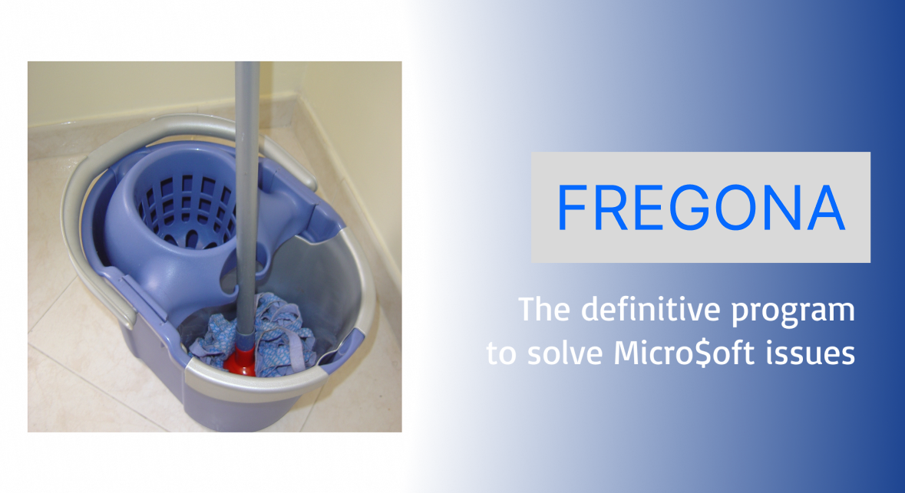

Fregona is the definitive mop for your day-to-day, you can save up to 80% of RAM by just using whatever is this program, without closing any program or tab in your browser!

## Downloads

You can download Fregona from [releases](https://github.com/tnfAngel/fregona/releases).

## Why?

**TL;DR:** Windows sucks.

Windows has a terrible memory management, it seems that it doesn't allocate space efficiently. If you have 64 GB of RAM that doesn't care (and if you run out of memory just buy another 64 GB) but in a computer with low resources having the worst memory allocator feels like a kick in the balls.

I discovered this while I was bored in class, and I named it Fregona (mop in Spanish) because it literally cleans the RAM like a mop scrubbing a dirty floor.

## How it works?

Fregona has an advanced complex AI algorithm that pushes useless data into a vector until the RAM is full of garbage and forces Windows to compress and optimize all existing allocations. Once RAM is properly optimized, Fregona closes by failed memory allocation.

This doesn't work on other OS (like Linux) because unlike Window$, memory allocators are well designed.

## Comparison

Fregona is better than CCleaner in all aspects. Just see this table to see the benefits of using Fregona over CCleaner:

|                          | Fregona | CCleaner |
| ------------------------ | ------ | -------- |
| Efficient memory clean   | ✅      | ❌        |
| Open source              | ✅      | ❌        |
| Secure                   | ✅      | ❌        |
| Simple                   | ✅      | ❌        |
| Free without ads         | ✅      | ❌        |
| Is a mop               | ✅🧹     | ❌        |
| Has annoying banners     | ❌      | ✅        |
| Removes critical files   | ❌      | ✅        |
| Boilerplate              | ❌      | ✅        |
| Is a spy Chinese balloon | ❌      | ✅🎈       |

Definitively CCleaner is holy trash, Fregona has 7291 useful features that anyone can use easily.

## Showcase

These screenshots show the unlimited power of Fregona. Thanks to [tnfAngel](https://github.com/tnfangel) for testing and sharing the screenshots!

Before Fregona execution, RAM usage was 43 GB. After a minute, RAM usage was 14 GB, that's 29 GB saved what the fuck is wrong with Micro$oft engineers? Sure they stole the allocator to someone like most of their products.

Fregona also helps the CPU by underclocking your CPU to 0 GHz

## License

Fregona is licensed under the [3-Clause BSD License](https://opensource.org/license/bsd-3-clause).

## Contribute

Any PR is welcome! Fregona is a small project, so please follow the code style and avoid making insane proposals.

*Gátomo - The 3-Clause BSD License*
